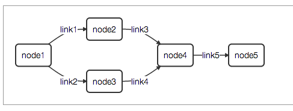

d3-dag-visualization
===============

DAG (directed acyclic graph) JavaScript visualization with D3.
[dagre-d3](https://github.com/cpettitt/dagre-d3) is used for graph layout and rendering.
Good for displaying flowchart and PERT chart-like graphs.

## Example Graph

## Usage

 Just open html file in browser, no server is required.
 Different graphs can be loaded using request parameter, e.g. index.html?graph2.js.

## Links

[D3](https://github.com/mbostock/d3) JavaScript Data Visualization library

[dagre](https://github.com/cpettitt/dagre) Graph layout for JavaScript

[dagre-d3](https://github.com/cpettitt/dagre-d3) D3-based renderer for dagre